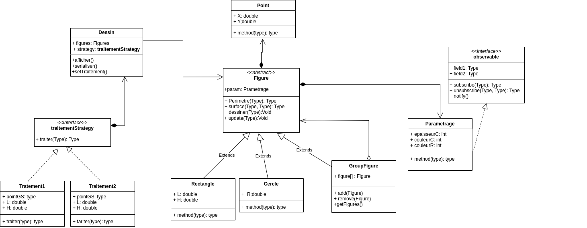
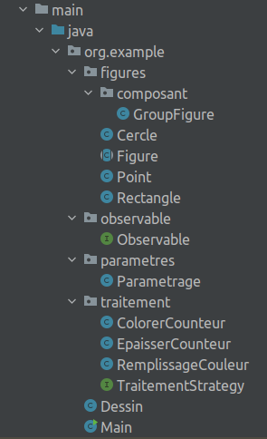
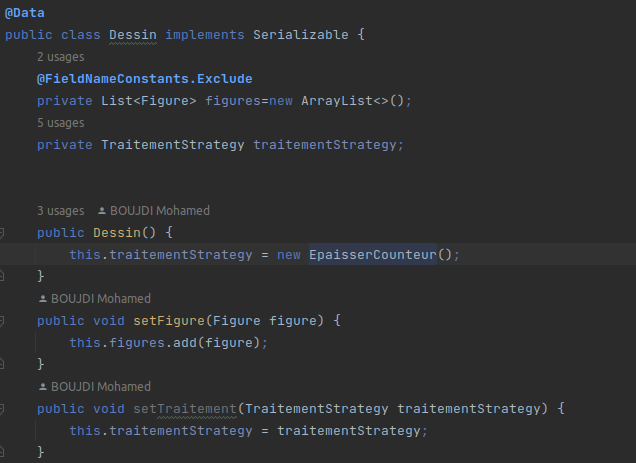
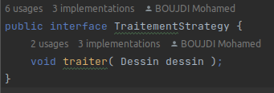
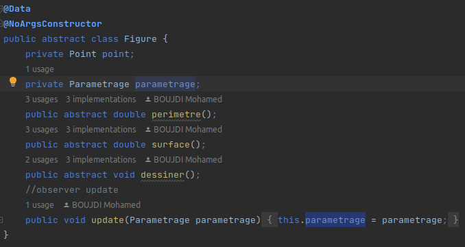
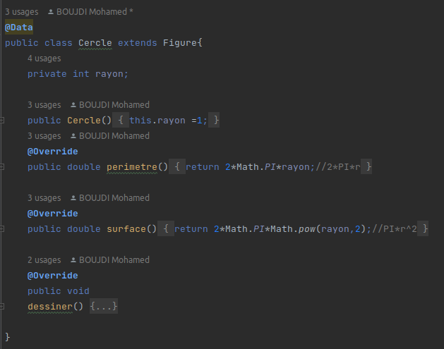
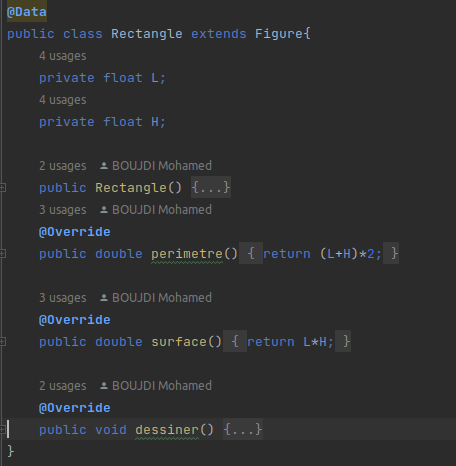
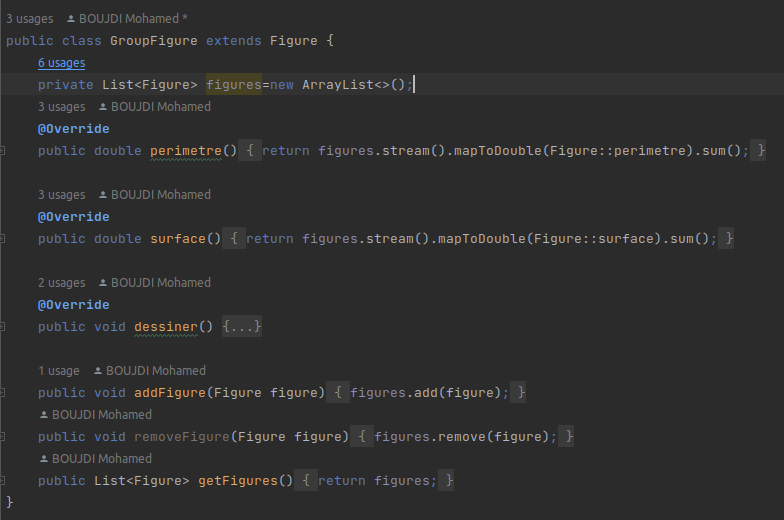
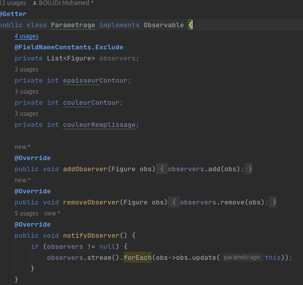

## Examen Blanc Design Pattern et Programmation Orientée Aspect

On souhaite concevoir et développer une application qui permet manipuler des dessins. Un Dessin
contient un ensemble de figures géométriques qui peuvent être soit des rectangles ou des cercles.
Pour chaque figure on souhaite calculer son périmètre et sa surface et on souhaite définir une méthode
qui permet de dessiner la figure (Afficher l’état de la figure). Un cercle est défini par son centre qui est
un point et par son rayon R. Un rectangle est défini par un point qui représente le coin supérieur
gauche, sa largeur L et sa hauteur H. Un point est définit par ses coordonnées X et Y. Pour le cercle, sa
surface veut π * R

2 alors sa surface vaut 2 * π *R. Pour le rectangle, sa surface veut L * H alors sa surface

vaut 2 *(L+H).
Chaque figure est définit également par des attributs de type entiers comme l’épaisseur du contour,
la couleur du contour et la couleur de remplissage.

### 1 - Modélisation "Diagramme de classe du modèle"
#### design pattern utilisé

### 2 - Implémentation de modèle

#### design pattern utilisé
##### Design pattern Strategy
   - **Dessin (Context)**
    
   - **Traitement (Strategy)**

- Design pattern Composite
    - **Figure**

    - **Cercle**

     -  **Rectangle**

    - **GroupFigure**

- Design pattern Observer
    - **Parametrage(Topic)**
  
    - **Figure(subscriber)**

